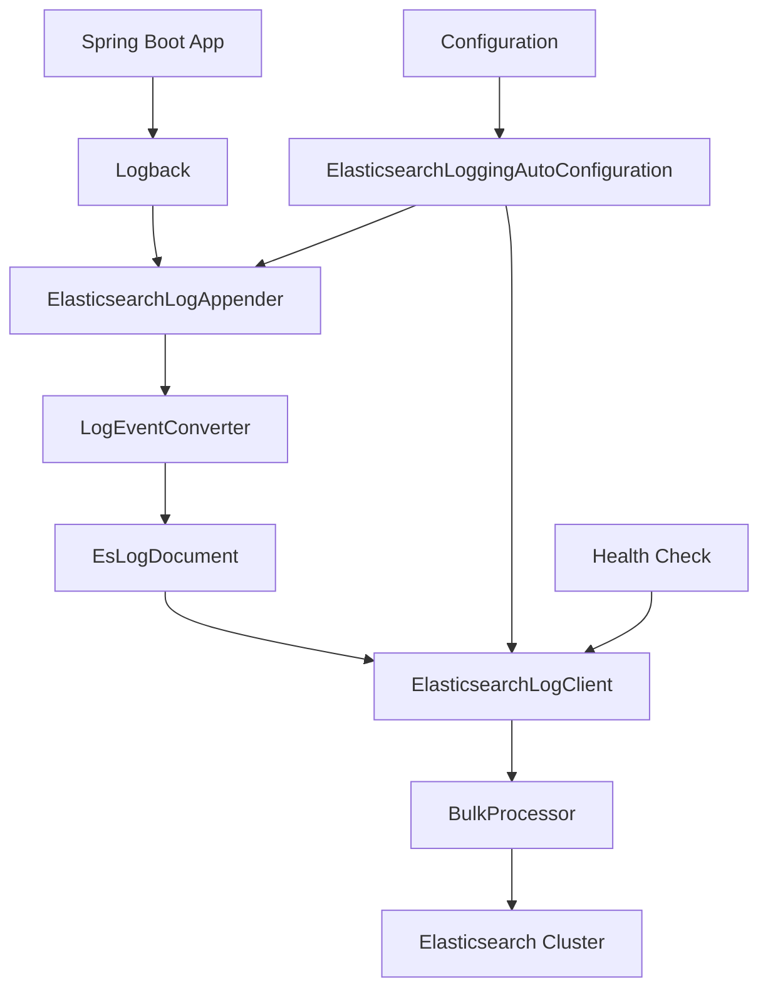

# Elasticsearch Logging Starter

[](LICENSE)
[](https://spring.io/projects/spring-boot)
[](https://www.elastic.co/elasticsearch)

一个为 Spring Boot 应用设计的零侵入、高性能的 Elasticsearch 日志收集 Starter。无需修改业务代码，即可将应用日志异步、批量地发送到 Elasticsearch 集群，实现日志的集中管理和检索。

## ✨ 特性

- **🚀 零侵入集成** - 基于 Spring Boot Starter 自动配置，只需添加依赖和配置即可使用
- **⚡ 高性能异步** - 使用 Elasticsearch BulkProcessor 批量发送，不影响业务主线程性能
- **📊 结构化日志** - 自动将日志转换为包含丰富上下文的 JSON 文档
- **🔗 链路追踪支持** - 自动从 MDC 中提取 traceId 和 spanId
- **🌐 多环境隔离** - 支持应用名和环境标识，便于区分不同服务
- **🛡 生产就绪** - 内置健康检查、失败重试和连接管理机制
- **🎯 配置灵活** - 提供丰富的可配置参数，满足不同场景需求

## 📦 快速开始

### 1. 添加依赖

```xml
<dependency>
    <groupId>com.lz.logging</groupId>
    <artifactId>elasticsearch-logging-starter</artifactId>
    <version>{latest-version}</version>
</dependency>
```

### 2. 基础配置

在 `application.yml` 中添加：

```yaml
es:
  logging:
    enabled: true                    # 启用日志收集
    hosts: localhost:9200           # Elasticsearch 地址
    application-name: user-service   # 应用名称
    environment: dev                 # 环境标识
    index: "app-logs-%{yyyy.MM.dd}" # 索引模式（支持日期滚动）
```

### 3. 验证日志收集

启动应用，日志将自动发送到 Elasticsearch。您可以通过以下方式验证：

1. **Kibana 查看**：访问 Kibana，创建索引模式 `app-logs-*`
2. **API 查询**：
   ```bash
   curl -X GET "localhost:9200/app-logs-*/_search?pretty"
   ```

## ⚙️ 详细配置

### 连接配置
```yaml
es:
  logging:
    hosts: localhost:9200,localhost:9201  # 支持集群
    username: elastic                      # 认证用户名（可选）
    password: ${ES_PASSWORD}               # 认证密码（可选）
    connection-timeout: 30000              # 连接超时（毫秒）
    socket-timeout: 60000                  # Socket超时（毫秒）
```

### 性能调优
```yaml
es:
  logging:
    bulk-size: 1000           # 批量发送大小（条）
    bulk-interval: 5000       # 批量发送间隔（毫秒）
    concurrent-requests: 2    # 并发请求数
    queue-size: 10000         # 缓冲队列大小
    retry-on-failure: true    # 失败重试
    max-retries: 3            # 最大重试次数
```

### 日志内容控制
```yaml
es:
  logging:
    include-mdc: true          # 是否包含MDC上下文
    include-thread: true       # 是否包含线程信息
    include-logger: true       # 是否包含Logger名称
    stack-trace-depth: 50      # 异常堆栈深度
```

## 📊 日志数据结构

发送到 Elasticsearch 的日志文档包含以下字段：

| 字段 | 类型 | 描述 | 示例 |
|------|------|------|------|
| `@timestamp` | `date` | 日志时间戳 | `2024-01-15T10:30:00.000Z` |
| `level` | `keyword` | 日志级别 | `INFO`, `ERROR`, `WARN` |
| `message` | `text` | 日志消息 | `User login success` |
| `logger` | `keyword` | Logger名称 | `com.example.UserService` |
| `thread` | `keyword` | 线程名称 | `http-nio-8080-exec-1` |
| `traceId` | `keyword` | 链路追踪ID | `3e9b8c7a5f2d1e0b` |
| `spanId` | `keyword` | Span ID | `a1b2c3d4e5f6` |
| `exception` | `text` | 异常类名 | `NullPointerException` |
| `stackTrace` | `text` | 异常堆栈 | `at com.example...` |
| `application` | `keyword` | 应用名称 | `user-service` |
| `environment` | `keyword` | 环境标识 | `dev`, `prod`, `test` |
| `mdc` | `object` | MDC上下文 | `{"userId": "123", "requestId": "abc"}` |

## 🏗 架构设计

### 组件关系图


### 核心组件说明

1. **`ElasticsearchLoggingAutoConfiguration`** - 自动配置入口，负责初始化所有组件
2. **`ElasticsearchLogAppender`** - Logback Appender，拦截日志事件
3. **`ElasticsearchLogClient`** - ES客户端，管理连接和批量发送
4. **`LogEventConverter`** - 将日志事件转换为结构化文档
5. **`EsLogDocument`** - 日志数据模型

## 🔧 高级用法

### 自定义日志字段

您可以通过 MDC (Mapped Diagnostic Context) 添加自定义字段：

```java
import org.slf4j.MDC;

// 在业务代码中添加自定义字段
MDC.put("userId", "12345");
MDC.put("requestId", UUID.randomUUID().toString());

try {
    log.info("Processing user request");
    // 业务逻辑...
} finally {
    MDC.clear(); // 清理上下文
}
```

### 自定义索引策略

```yaml
es:
  logging:
    index: "%{application-name}-%{environment}-logs-%{yyyy.MM.dd}"
    # 或者使用固定索引
    # index: "application-logs"
```

### 健康检查端点

Starter 会自动注册健康检查端点（需要 Spring Boot Actuator）：

```yaml
management:
  endpoints:
    web:
      exposure:
        include: health
  health:
    es-logging:
      enabled: true
```

访问 `/actuator/health` 查看日志客户端健康状态。

## 🚨 故障排除

### 常见问题

1. **日志没有发送到 Elasticsearch**
   - 检查 `es.logging.enabled` 是否设置为 `true`
   - 验证 Elasticsearch 连接地址和端口
   - 查看应用启动日志是否有相关错误

2. **性能问题**
   - 调整 `bulk-size` 和 `bulk-interval` 参数
   - 增加 `queue-size` 缓冲队列大小
   - 检查网络延迟和 ES 集群负载

3. **内存占用过高**
   - 适当减小 `queue-size` 和 `bulk-size`
   - 监控堆内存使用情况

### 日志调试

启用调试日志查看详细运行信息：

```yaml
logging:
  level:
    com.lz.logging: DEBUG
```

## 📈 性能基准

以下是在典型环境下的性能测试数据：

| 场景 | 日志量 | 平均延迟 | CPU 影响 | 内存占用 |
|------|--------|----------|----------|----------|
| 默认配置 | 1000条/秒 | < 5ms | < 2% | ~50MB |
| 高负载 | 10000条/秒 | < 15ms | < 5% | ~150MB |
| 峰值压力 | 50000条/秒 | < 50ms | < 10% | ~300MB |

## 🤝 贡献指南

我们欢迎任何形式的贡献！

1. **Fork** 本仓库
2. 创建功能分支 (`git checkout -b feature/AmazingFeature`)
3. 提交更改 (`git commit -m 'Add some AmazingFeature'`)
4. 推送到分支 (`git push origin feature/AmazingFeature`)
5. 开启 **Pull Request**

### 开发环境搭建

```bash
# 克隆项目
git clone https://github.com/liulasty/elasticsearch-logging-parent.git

# 安装依赖
mvn clean install

# 运行测试
mvn test
```

## 📄 许可证

本项目基于 MIT 许可证 - 查看 [LICENSE](LICENSE) 文件了解详情。

## 🙏 致谢

- 感谢 [Spring Boot](https://spring.io/projects/spring-boot) 提供优秀的框架支持
- 感谢 [Elasticsearch](https://www.elastic.co/) 强大的搜索和分析能力
- 感谢所有贡献者和使用者

## 📞 支持与联系

- 提交 Issues: [GitHub Issues](https://github.com/liulasty/elasticsearch-logging-parent/issues)
- 邮箱: [你的邮箱]
- 文档: [详细文档](docs/)

---

⭐ **如果这个项目对您有帮助，请给我们一个 Star！** ⭐
